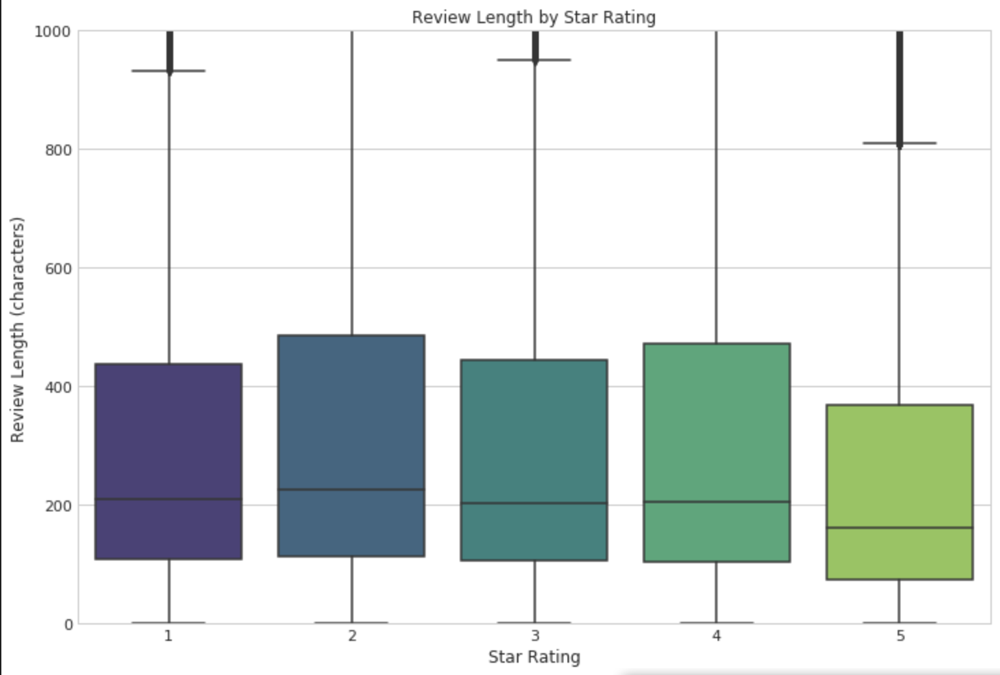
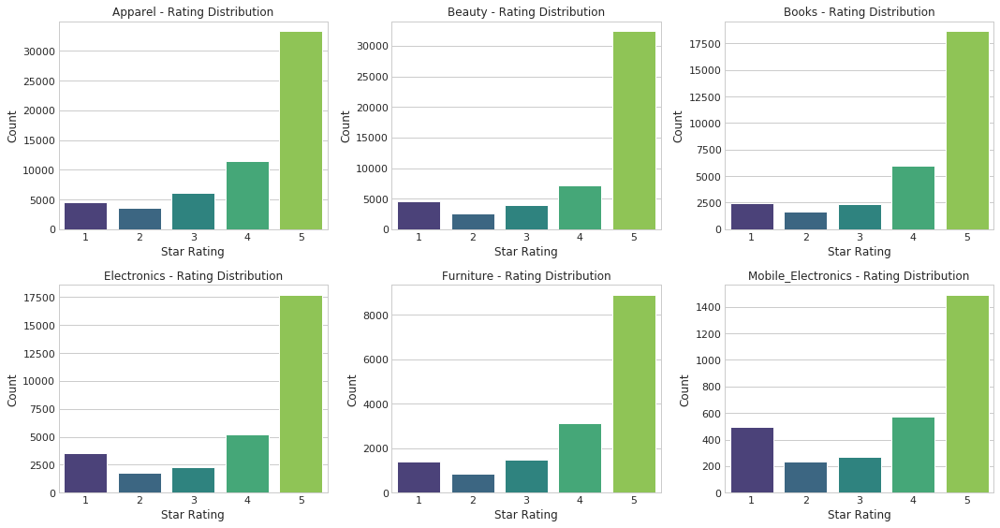
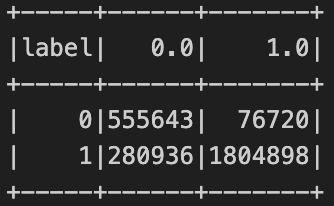
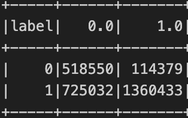

# Sentiment Analysis of Amazon Product Reviews Using Machine Learning at Scale

---

## Overview

Star ratings are a convenient summary of customer feedback but they only tell part of the story. The real substance often lies in the text: what people write when they explain why they liked or disliked something.

In this project, we wanted to explore whether a machine learning model could learn to identify **positive vs. negative sentiment** based on how people write not just the rating they gave. We weren’t trying to predict star ratings directly. Instead, we used them to label our training data (1–3 stars as negative, 4–5 as positive) and focused on teaching a model to recognize **tone, expression, and emotion** in written reviews.

This matters because, at scale, platforms can't read every review and star ratings alone don’t always capture nuance. By modeling how sentiment is expressed in writing, we create a foundation for smarter tools: better feedback analysis, trend detection, review summarization, and more.

Using PySpark on Google Cloud, we processed over 18 million reviews across six Amazon product categories. We engineered custom features from review text, metadata, and sentiment lexicons, and trained multiple classifiers to see how well sentiment could be predicted. Our final model achieved an F1 score of ~87%, showing strong performance and surfacing patterns that go beyond the star.

---

## Problem Statement

Customer reviews are rich in language, emotion, and personal experience but this is hard to quantify at scale. Most platforms rely on star ratings as a proxy for satisfaction, but those ratings don’t always reflect how someone *feels*. Some 4-star reviews are cautious or mixed. Some 2-star reviews are calmly written. Others don’t match the text at all.

We set out to build a model that could learn from how people write when they’re satisfied or disappointed and use that to classify sentiment as positive or negative. While we used star ratings to supervise the model, the goal was to go beyond ratings and capture the way people express sentiment.

We trained and evaluated multiple models using features such as:
- TF-IDF vectors of review text
- Verified purchase, Vine program, product category
- Voting behavior (helpful votes, total votes)
- Temporal features (year, month, day of week)
- Custom sentiment lexicon scores and ratios
- Word2Vec embeddings trained on review text

The result is a scalable sentiment analysis model that reflects how customers communicate opinions and provides a path toward deeper analysis of feedback.

---

## Exploratory Data Analysis (EDA)

We performed initial EDA to understand the distribution of star ratings and review behaviors. Here are two visual highlights:

### 1. Review Length by Star Rating



> Longer reviews tended to appear with extreme star ratings (1 or 5), suggesting more emotion or detailed feedback.

### 2. Rating Distribution by Category



> The distribution was heavily skewed towards 5-star reviews across all categories an important class imbalance consideration during model training.

---

## Data Sources and Description

- **Dataset**: [Amazon US Customer Reviews Dataset](https://www.kaggle.com/datasets/cynthiarempel/amazon-us-customer-reviews-dataset)
- **Size**: ~18 million reviews across 6 categories:
  - Apparel, Beauty, Books, Electronics, Furniture, Mobile Electronics
- **Format**: TSV (tab-separated), per category
- **Fields Used**:
  - review_body, star_rating, review_date
  - product_category, verified_purchase, helpful_votes, total_votes
  - vine (Amazon Vine program), review_headline

> Note: No significant missing values in core fields. Reviews under 5 characters were filtered.

---

## Approach and Methodology

### 1. Data Ingestion and Cleaning
- Downloaded via Kaggle API, selected categories extracted
- Uploaded to GCS, parsed with PySpark
- Created features: `helpful_ratio`, `review_length`, `has_votes`, etc.
- Saved cleaned data as Parquet

### 2. Feature Engineering

| Feature                     | Description                                |
|-----------------------------|--------------------------------------------|
| TF-IDF                      | Sparse representation of review text       |
| helpful_ratio               | Helpful votes / total votes                |
| has_votes                   | Binary: whether the review received votes  |
| vine_binary                 | Whether part of Amazon Vine program        |
| verified_purchase_binary    | Whether purchase was verified              |
| product_category_vec        | One-hot encoding of category               |                          
| sentiment_score             | Count(pos_words) - Count(neg_words)        |
| positive_ratio              | % of words that were positive              |
| negative_ratio              | % of words that were negative              |
| w2v_vector                  | Word2Vec embeddings (50-dimensions)        |

### 3. Modeling and Experiments

- **Binary sentiment classification**:
  - 1–3 stars = Negative (Label = 0)
  - 4–5 stars = Positive (Label = 1)
- **Models**:
  - Logistic Regression (with class weights)
  - Random Forest (with downsampling)
- **Hyperparameters Tuned**:
  - `regParam`, `elasticNetParam`, `numTrees`, `maxDepth`
- **Split**: Time-based 70/15/15 for train/val/test

---

## Results and Key Experiments

| Model               | Dataset     | Accuracy | F1 Score |
|---------------------|-------------|----------|----------|
| Logistic Regression | Validation  | 86.84%   | 87.41%   |
| Logistic Regression | Test        | 86.84%   | 87.42%   |
| Random Forest       | Validation  | 76.62%   | 78.31%   |
| Random Forest       | Test        | 76.68%   | 78.37%   |

### Key Insights:
- **Word2Vec** embeddings gave a major boost — showing deep language context matters
- Simple **sentiment lexicons** worked surprisingly well and complemented embeddings
- **Class imbalance** required handling: class weights helped logistic regression, downsampling helped Random Forest
- Logistic Regression was faster, more scalable, and easier to interpret — our final choice

---

## Infrastructure

- **Cloud**: Google Cloud Platform (GCP)
- **Processing**: PySpark on Google Dataproc
- **Storage**: Google Cloud Storage (GCS)
- **Notebook Interface**: JupyterHub
- **Cluster Specs**:
  - Master: `n4-standard-4` (4 vCPU, 16 GB RAM)
  - Workers (2): `n4-standard-2` (2 vCPU, 8 GB RAM each)
  - “Internal IP only” must be unchecked

---

## Timeline and Deliverables

| Milestone     | Description                                                       |
|---------------|-------------------------------------------------------------------|
| Milestone 0   | Project kickoff, dataset selection, GCP environment setup         |
| Milestone 1   | Data ingestion, EDA, imbalance analysis                           |
| Milestone 2   | Feature engineering, TF-IDF baseline                              |
| Milestone 3   | Sentiment-aware features, Word2Vec, model tuning                  |
| Final Report  | Consolidated write-up, visuals, and replication instructions      |

---

## Resources

- Dataset: https://www.kaggle.com/datasets/cynthiarempel/amazon-us-customer-reviews-dataset  
- Tools: PySpark, Gensim, NLTK, Scikit-learn, Pandas  
- Platform: Google Cloud (Dataproc, GCS)

---

## How to Contribute

This project is currently closed-source and not accepting contributions.

---

## Sample Run / Output

Final evaluation results visualized using confusion matrices:

### Logistic Regression  


### Random Forest  


---
## Repository Structure

```
sentiment-analysis-amazon/
│
├── README.md
├── replication_guide.md
│
├── notebooks/
│   ├── 0_download_dataset.ipynb
│   ├── 1_data_loading_joining.ipynb
│   ├── 2_initial_eda.ipynb
│   ├── 3_data_cleaning.ipynb
│   ├── 4_review_sentiment_modeling.ipynb
│   └── 5_hyperparameter_sentiment.ipynb
│
├── images/
│   ├── length_star.png
│   ├── star_rating.png
│   ├── LR_confusion.png
│   └── RF_confusion.png
│
└── sentiment_project_replication.zip

